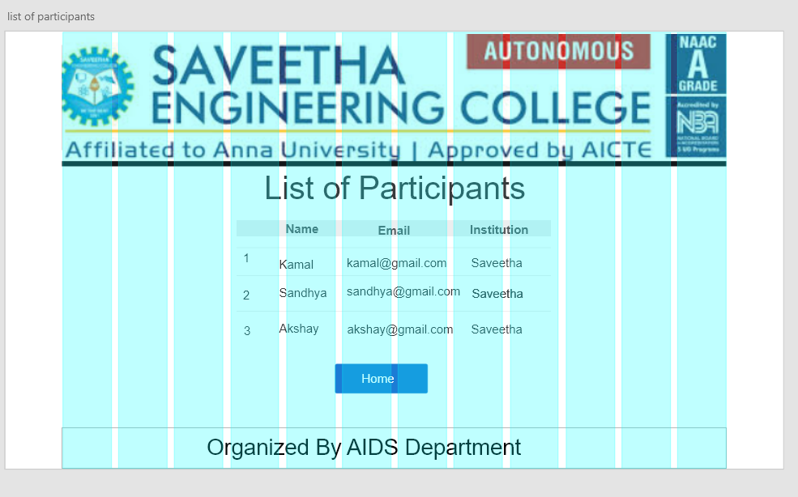

# WebApplication for Event Registration

## AIM:
To create a UX design and develop a web application for event registration.
## DESIGN STEPS:
### Step 1: 
Requirement collection.
### Step 2:
Choosing the suitable color scheme
### Step 3:
Creating artboards for individual pages
### Step 4:
Designing layout for individual pages
### Step 5:
Creating links and linking it with artboards
### Step 6:
Preview the prototype.

## DESIGN SCREENS:

## WIREFRAME:

## PROTOTYPE:

## PROGRAM:
### home.html

<!doctype html>
<html lang="en">

<head>
    <!-- Required meta tags -->
    <meta charset="utf-8">
    <meta name="viewport" content="width=device-width, initial-scale=1, shrink-to-fit=no">

    <!-- Bootstrap CSS -->
    <link rel="stylesheet" href="https://maxcdn.bootstrapcdn.com/bootstrap/4.0.0/css/bootstrap.min.css"
        integrity="sha384-Gn5384xqQ1aoWXA+058RXPxPg6fy4IWvTNh0E263XmFcJlSAwiGgFAW/dAiS6JXm" crossorigin="anonymous">

    <title>Saveetha Engineering College</title>
</head>

<body>

    

        

            

                

                    <h1 class="display-4">Robotics Event</h1>
                    
An Interaction with Robotics

                    

                    
The participants will be exposed to problem-solving activities, infrastructure of Robotics and
                        future of
                        Robotics.

                

                

                

            

            

                

                    

                        <h1>Join us and learn more about Robotics</h1>
                        

                        

                    

                

                

                    

                        

                            <a href="/register/" class="btn btn-primary" role="button"
                                aria-disabled="true">Registration</button>

                                <!-- Optional JavaScript -->
                                <!-- jQuery first, then Popper.js, then Bootstrap JS -->
                                
                                
                                
</body>

</html>

### register.html

<!doctype html>
<html lang="en">

<head>
    <!-- Required meta tags -->
    <meta charset="utf-8">
    <meta name="viewport" content="width=device-width, initial-scale=1, shrink-to-fit=no">

    <!-- Bootstrap CSS -->
    <link rel="stylesheet" href="https://maxcdn.bootstrapcdn.com/bootstrap/4.0.0/css/bootstrap.min.css"
        integrity="sha384-Gn5384xqQ1aoWXA+058RXPxPg6fy4IWvTNh0E263XmFcJlSAwiGgFAW/dAiS6JXm" crossorigin="anonymous">

    <title>Event Management</title>
</head>

<body>
    

        

            

                

            <h1 class="display-4">Robotics Event</h1>
            
An Interaction with Robotics

            

            
The participants will be exposed to problem-solving activities, infrastructure of Robotics and future of
                Robotics.

            

            

        

    

    

         

            

                

        

            

                <h1>Application</h1>
            

        

        <form method="POST" action="/register/">
            

            

                <label for="name">Name</label>
                <input type="name" class="form-control" name="username" id="username" aria-describedby="emailHelp"
                    placeholder="Enter name">
            

            

                <label for="phone">Phone</label>
                <input type="phone" class="form-control" name="phone" id="phone" placeholder="phone">
            

            

                <label for="exampleInputEmail1">Email address</label>
                <input type="email" class="form-control" name="exampleInputEmail1" id="exampleInputEmail1"
                    aria-describedby="emailHelp" placeholder="Enter email">
                <small id="emailHelp" class="form-text text-muted">We'll never share your email with anyone
                    else.</small>
            

            

                <label for="institutionname">Institution name</label>
                <input type="institutionname" class="form-control" name="institutionname" name="institutionname"
                    id="institutionname" placeholder="institutionname">
            

            <button type="submit" class="btn btn-primary">Submit</button>
        </form>

    

    <!-- Optional JavaScript -->
    <!-- jQuery first, then Popper.js, then Bootstrap JS -->
    
    
    
</body>

</html>

### success.html

<!doctype html>
<html lang="en">

<head>
    <!-- Required meta tags -->
    <meta charset="utf-8">
    <meta name="viewport" content="width=device-width, initial-scale=1, shrink-to-fit=no">

    <!-- Bootstrap CSS -->
    <link rel="stylesheet" href="https://maxcdn.bootstrapcdn.com/bootstrap/4.0.0/css/bootstrap.min.css"
        integrity="sha384-Gn5384xqQ1aoWXA+058RXPxPg6fy4IWvTNh0E263XmFcJlSAwiGgFAW/dAiS6JXm" crossorigin="anonymous">

    <title>Saveetha Engineering College</title>
</head>

<body>
    

        

             

            

                

            <h1 class="display-4">Robotics Event</h1>
            
An Interaction with Robotics

            

            
The participants will be exposed to problem-solving activities, infrastructure of Robotics and future of
                Robotics.

            

            

        

    

    

         
            

                

        

            

                <h1>Congragulations!You're in.</h1>
                
We hope you have fun and learn more about robotics. Thank You and Have a great day.

                

            <a href="/home/" class="btn btn-primary btn-lg active" role="button" aria-pressed="true">Home</a>
    

                <!-- Optional JavaScript -->
                <!-- jQuery first, then Popper.js, then Bootstrap JS -->
                
                
                
</body>

</html>

### failed.html

<!doctype html>
<html lang="en">

<head>
    <!-- Required meta tags -->
    <meta charset="utf-8">
    <meta name="viewport" content="width=device-width, initial-scale=1, shrink-to-fit=no">

    <!-- Bootstrap CSS -->
    <link rel="stylesheet" href="https://maxcdn.bootstrapcdn.com/bootstrap/4.0.0/css/bootstrap.min.css"
        integrity="sha384-Gn5384xqQ1aoWXA+058RXPxPg6fy4IWvTNh0E263XmFcJlSAwiGgFAW/dAiS6JXm" crossorigin="anonymous">

    <title>Saveetha Engineering College</title>
</head>

<body>
    

        

             

            

                

            <h1 class="display-4">Robotics Event</h1>
            
An Interaction with Robotics

            

            
The participants will be exposed to problem-solving activities, infrastructure of Robotics and future of
                Robotics.

            

            

        

    

    

        

            

                <h1>Sorry!</h1>
                
Try again next time.Have a good day.

                

    <a href="/home/" class="btn btn-primary btn-lg active" role="button" aria-pressed="true">Home</a>
    

    <!-- Optional JavaScript -->
    <!-- jQuery first, then Popper.js, then Bootstrap JS -->
    
    
    
</body>

</html>

### participants.html

<!doctype html>
<html lang="en">

<head>
    <!-- Required meta tags -->
    <meta charset="utf-8">
    <meta name="viewport" content="width=device-width, initial-scale=1, shrink-to-fit=no">

    <!-- Bootstrap CSS -->
    <link rel="stylesheet" href="https://maxcdn.bootstrapcdn.com/bootstrap/4.0.0/css/bootstrap.min.css"
        integrity="sha384-Gn5384xqQ1aoWXA+058RXPxPg6fy4IWvTNh0E263XmFcJlSAwiGgFAW/dAiS6JXm" crossorigin="anonymous">

    <title>Saveetha Engineering College</title>
</head>

<body>
    

        

             
            

                

            <h1 class="display-4">Robotics Event</h1>
            
An Interaction with Robotics

            

            
The participants will be exposed to problem-solving activities, infrastructure of Robotics and future of
                Robotics.

            

                
            

        

    

    

         

            

                

        

            

                <h1>Congragulations!</h1>
            

        

        

            

                <table class="table">
                    <thead>
                        <tr>
                            <th scope="col">NAME</th>
                            <th scope="col">EMAIL</th>
                            <th scope="col">PHONE</th>
                            <th scope="col">INSTITUTION</th>
                        </tr>
                    </thead>
                    <tbody>

                        <tr>
                            <td>Kamal</td>
                            <td>raja@gmail.com</td>
                            <td>1564820000</td>
                            <td>Saveetha</td>
                        </tr>

                        <tr>
                            <td>Sandhya</td>
                            <td>sandhya@gmail.com</td>
                            <td>23424200000</td>
                            <td>Saveetha</td>
                        </tr>

                        <tr>
                            <td>Akshay</td>
                            <td>akshay@gmail.com</td>
                            <td>1234567890</td>
                            <td>Saveetha</td>
                        </tr>

                        <tr>
                            <td>Sasi Reddy</td>
                            <td>reddy@gmail.com</td>
                            <td>2342200350</td>
                            <td>Saveetha</td>
                        </tr>

                        <tr>
                            <td>Ajay</td>
                            <td>ajay@gmail.com</td>
                            <td>1599517530</td>
                            <td>Saveetha</td>
                        </tr>

                        <tr>
                            <td>Sierra</td>
                            <td>sierra@gmail.com</td>
                            <td>7533572580</td>
                            <td>Saveetha</td>
                        </tr>

                        <tr>
                            <td>Vishal</td>
                            <td>vishal@gmail.com</td>
                            <td>1477413690</td>
                            <td>Saveetha</td>
                        </tr>

                        <tr>
                            <td>Sandy</td>
                            <td>sandy@gmail.com</td>
                            <td>3699632580</td>
                            <td>Saveetha</td>
                        </tr>

                        <tr>
                            <td>Linda</td>
                            <td>linda@gmail,com</td>
                            <td>3216549870</td>
                            <td>Saveetha</td>
                        </tr>

                        <tr>
                            <td>Tia</td>
                            <td>tia@gmail.com</td>
                            <td>7894561230</td>
                            <td>Saveetha</td>
                        </tr>

                        <tr>
                            <td>Ziya</td>
                            <td>ziya@gmail.com</td>
                            <td>1234567890</td>
                            <td>Saveetha</td>
                        </tr>

                        <tr>
                            <td>Willson</td>
                            <td>will@gmail.com</td>
                            <td>4561237890</td>
                            <td>Saveetha</td>
                        </tr>

                        <tr>
                            <td>Karl</td>
                            <td>karl@gmail.com</td>
                            <td>7891234560</td>
                            <td>Saveetha</td>
                        </tr>

                        <tr>
                            <td>Shalini</td>
                            <td>shalini@gmail.com</td>
                            <td>1473692580</td>
                            <td>Saveetha</td>
                        </tr>

                        <tr>
                            <td>Anu</td>
                            <td>anu@gmail.com</td>
                            <td>2583691470</td>
                            <td>Saveetha</td>
                        </tr>

                    </tbody>
                </table>
            

        

        

            

                <a href="/home/" class="btn btn-primary btn-lg" role="button">Home</a>
            

        

    

    <!-- Optional JavaScript -->
    <!-- jQuery first, then Popper.js, then Bootstrap JS -->
    
    
    
</body>

</html>

## OUTPUT:

## RESULT:
 Thus, a UX design is created and a web application is developed for event registration is the url http://sanjnapriya.student.saveetha.in:8000/home/.